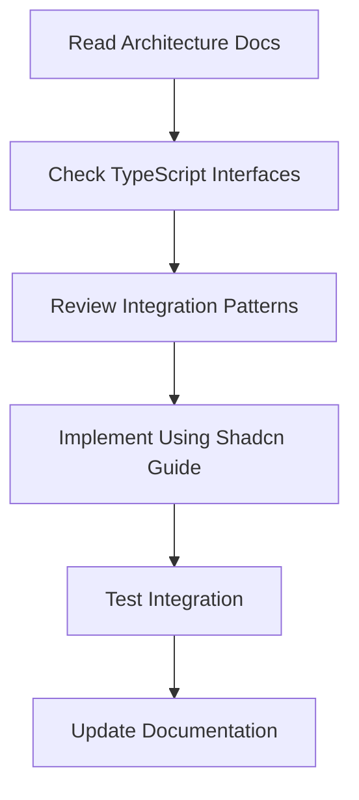

# Frontend Documentation Overview

## Documentation Structure

This directory contains comprehensive documentation for the video conferencing frontend, organized to mirror the elegance and clarity of your Go backend documentation.

### Core Documentation Files

#### 1. COMPONENT_ARCHITECTURE.md

- **Purpose**: Explains how Shadcn UI components are organized and used
- **Audience**: Frontend developers implementing UI components
- **Key Topics**: Component categories, usage patterns, architectural principles
- **When to Use**: When designing new UI components or understanding existing ones

#### 2. SHADCN_IMPLEMENTATION.md

- **Purpose**: Complete implementation guide with production-ready code
- **Audience**: Developers ready to build the actual components
- **Key Topics**: Full component implementations, TypeScript interfaces, integration patterns
- **When to Use**: During active development and implementation phases

#### 3. HOOKS_INTEGRATION.md

- **Purpose**: Shows how custom hooks connect with Shadcn UI components
- **Audience**: Developers working on the business logic to UI integration
- **Key Topics**: Hook-to-component mapping, data flow patterns, complete examples
- **When to Use**: When integrating business logic with presentation layer

#### 4. TYPESCRIPT_INTERFACES.md

- **Purpose**: Comprehensive type definitions for the entire application
- **Audience**: All developers working on type-safe implementations
- **Key Topics**: Interface definitions, hook return types, component props, utilities
- **When to Use**: Reference for type definitions and ensuring type safety

#### 5. HOOKS_GUIDE.md

- **Purpose**: Advanced hooks documentation with sophisticated connection and media management
- **Audience**: Developers working on complex business logic, real-time connections, and media handling
- **Key Topics**: useRoomConnection, useMediaStream, useRoomUI, useDeviceCapabilities, error handling, performance optimization
- **When to Use**: When implementing advanced connection features, media stream management, device handling, or understanding hook composition patterns

#### 6. AUTHENTICATION.md (Existing)

- **Purpose**: Authentication flow and security implementation
- **Audience**: Developers implementing auth features
- **Key Topics**: JWT handling, session management, security patterns

## Documentation Philosophy

### Mirroring Backend Excellence

Just as your Go backend follows clean architecture principles:

```text
backend/go/
├── cmd/           # Entry points
├── internal/      # Core business logic
│   ├── api/       # HTTP handlers
│   └── v1/        # Domain logic
└── deploy/        # Infrastructure
```

Our frontend documentation follows similar organization:

```text
frontend/docs/
├── COMPONENT_ARCHITECTURE.md    # UI structure (like internal/api)
├── SHADCN_IMPLEMENTATION.md     # Implementation details (like cmd)
├── HOOKS_INTEGRATION.md         # Integration layer (like handlers)
├── TYPESCRIPT_INTERFACES.md     # Type contracts (like domain models)
└── HOOKS_GUIDE.md              # Business logic (like internal/v1)
```

### Design Principles

#### 1. **Separation of Concerns**

- **Components** handle presentation (like HTTP handlers)
- **Hooks** handle business logic (like domain services)
- **Types** define contracts (like domain models)
- **Integration** manages data flow (like use cases)

#### 2. **Progressive Disclosure**

- Start with **COMPONENT_ARCHITECTURE.md** for overview
- Move to **SHADCN_IMPLEMENTATION.md** for specifics
- Reference **TYPESCRIPT_INTERFACES.md** for types
- Use **HOOKS_INTEGRATION.md** for connections

#### 3. **Practical Examples**

- Every concept includes working code
- Real-world usage patterns
- Production-ready implementations
- Clear integration paths

## How to Use This Documentation

### For New Team Members

#### Week 1: Understanding the Architecture

1. Read **COMPONENT_ARCHITECTURE.md** - Understand UI organization
2. Review **HOOKS_GUIDE.md** - Learn business logic patterns
3. Scan **TYPESCRIPT_INTERFACES.md** - Familiarize with types

#### Week 2: Hands-On Implementation

1. Follow **SHADCN_IMPLEMENTATION.md** - Build your first component
2. Use **HOOKS_INTEGRATION.md** - Connect hooks to UI
3. Reference **TYPESCRIPT_INTERFACES.md** - Ensure type safety

### For Feature Development

#### Planning Phase

- Review **COMPONENT_ARCHITECTURE.md** for UI patterns
- Check **TYPESCRIPT_INTERFACES.md** for existing types
- Plan integration using **HOOKS_INTEGRATION.md** patterns

#### Implementation Phase

- Use **SHADCN_IMPLEMENTATION.md** for component code
- Follow **HOOKS_INTEGRATION.md** for data flow
- Reference **TYPESCRIPT_INTERFACES.md** for type definitions

#### Testing Phase

- Verify patterns match **COMPONENT_ARCHITECTURE.md**
- Test integration points from **HOOKS_INTEGRATION.md**
- Validate types using **TYPESCRIPT_INTERFACES.md**

### For Code Reviews

#### Architecture Review

- Does it follow **COMPONENT_ARCHITECTURE.md** patterns?
- Are hooks properly integrated per **HOOKS_INTEGRATION.md**?
- Are types defined in **TYPESCRIPT_INTERFACES.md**?

#### Implementation Review

- Does code match **SHADCN_IMPLEMENTATION.md** standards?
- Are accessibility features implemented correctly?
- Is error handling following documented patterns?

## Quick Reference

### Common Tasks

#### Adding a New Component

1. Check **COMPONENT_ARCHITECTURE.md** for category
2. Use **SHADCN_IMPLEMENTATION.md** as template
3. Define types in **TYPESCRIPT_INTERFACES.md**
4. Integrate using **HOOKS_INTEGRATION.md** patterns

#### Connecting a Hook to UI

1. Review hook in **HOOKS_GUIDE.md**
2. Find integration pattern in **HOOKS_INTEGRATION.md**
3. Apply types from **TYPESCRIPT_INTERFACES.md**

#### Understanding Data Flow

1. Start with **HOOKS_INTEGRATION.md** examples
2. Trace through **COMPONENT_ARCHITECTURE.md** patterns
3. Validate with **TYPESCRIPT_INTERFACES.md** types

## Standards

### Code Standards

- **Complete imports** - Never assume imports

## Documentation Standards

### Code Examples

All code examples follow these standards:

- **Complete imports** - Never assume imports
- **TypeScript types** - Always include proper typing
- **Accessibility** - ARIA labels and semantic HTML
- **Error handling** - Proper error boundaries and loading states
- **Comments** - Explain business logic and complex patterns

### Structure Consistency

Each documentation file follows:

- **Overview** - Clear purpose and scope
- **Core Content** - Main documentation with examples
- **Integration** - How it connects to other parts
- **Best Practices** - Do's and don'ts
- **Reference** - Quick lookup information

### Maintenance

Documentation is updated:

- **With every feature** - New components get documented
- **During refactoring** - Patterns get updated
- **After reviews** - Feedback gets incorporated
- **Regular audits** - Ensure accuracy and completeness

## Integration with Development Workflow

### Development Process



### CI/CD Integration

Documentation quality is enforced through:

- **Lint checks** - Markdown formatting and structure
- **Link validation** - All internal references work
- **Code example testing** - Examples compile and run
- **Accessibility validation** - Examples meet WCAG standards

## Support and Questions

### Getting Help

1. **Check documentation first** - Most questions are answered here
2. **Search existing issues** - Problem might be known
3. **Ask in team channels** - Quick questions and clarifications
4. **Create documentation issues** - For missing or unclear docs

### Contributing to Documentation

1. **Follow existing patterns** - Maintain consistency
2. **Include working examples** - Always provide code
3. **Test your examples** - Ensure they work
4. **Update related docs** - Keep everything in sync

This documentation system provides a complete, maintainable, and scalable foundation that grows with your application while maintaining the same professional standards as your Go backend.
